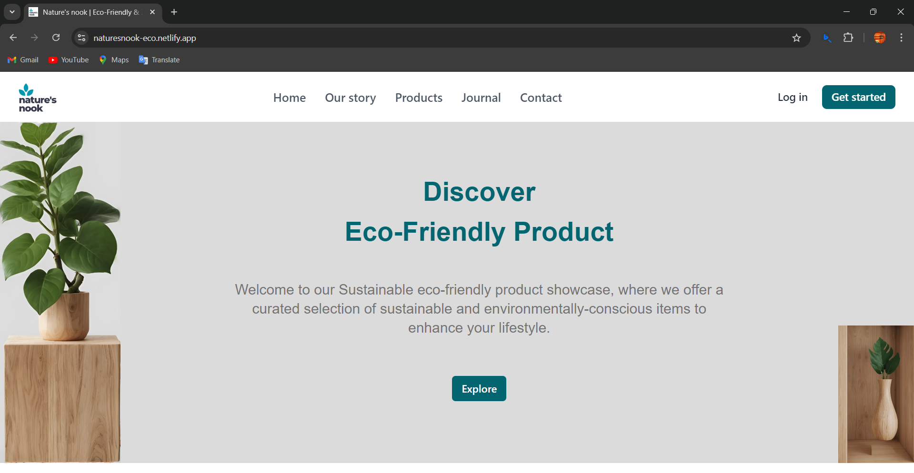

# Natures's nook

Welcome to NaturesNook, a web application built with React, Vite, and Tailwind CSS. This project is designed to provide an intuitive user experience while promoting eco-friendly products.

The Eco-Friendly Product Showcase is a web platform designed to highlight and promote sustainable products, aiming to connect eco-conscious consumers with environment friendly products. The project seeks to support green businesses by providing them with a dedicated space to showcase their products, while also educating consumers on the benefits of sustainable living. By leveraging modern web technologies, the Eco-Friendly Product Showcase provides a seamless and engaging user experience that encourages sustainable consumption and fosters environmental awareness.

## Features
- **Home Page**: Overview of eco-friendly products.
- **About Page**: Information about the mission and vision.
- **Contact Page**: Get in touch with the team.
- **Product Page**: Display of various product categories.
- **Journal Page**: Stories and blogs related to eco-friendly living.
- **User Authentication**: Sign in and Sign up functionality.

## Live Demo: [naturesnook-eco](https://naturesnook-eco.netlify.app)
